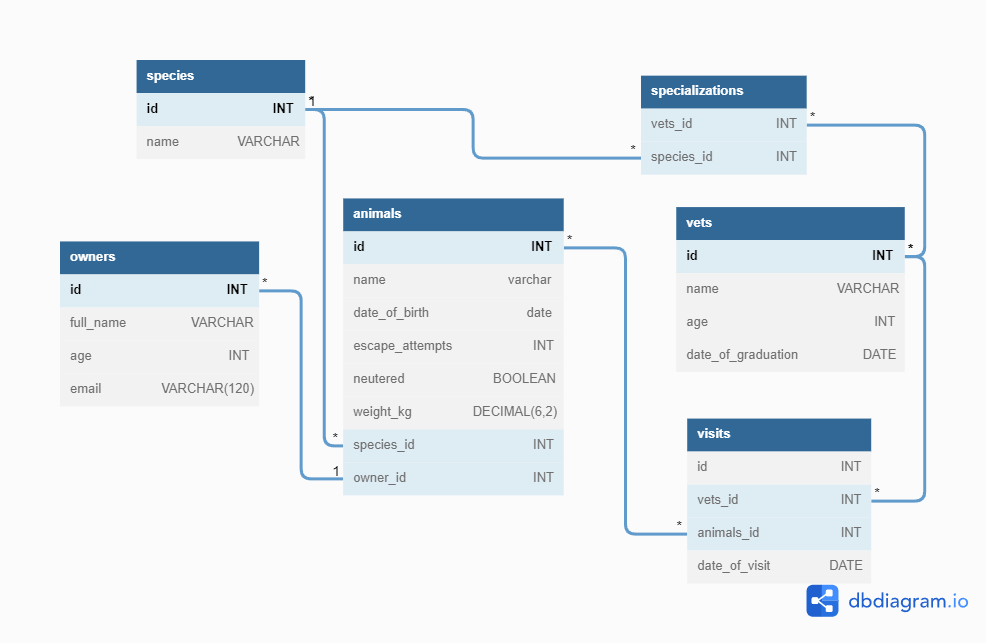

# Vet_clinic databases-projects

> This projects uses a relational database to create the initial data structure for a vet clinic. Within the database, I created a table to store animals' information, insert some data into it, and query it.

## Schema Diagram

## Getting Started

This repository includes files with plain SQL that can be used to recreate a database:

- Use [schema.sql](./schema.sql) to create all tables.
- Use [data.sql](./data.sql) to populate tables with sample data.
- Check [queries.sql](./queries.sql) for examples of queries that can be run on a newly created database. **Important note: this file might include queries that make changes in the database (e.g., remove records). Use them responsibly!**

## Authors

| 👤 Name | Github | Twitter | LinkedIn |
|------|--------|---------|----------|
|Robertson Akpan|[@bobb-rob](https://github.com/bobb-rob)|[@___Robertson](https://twitter.com/___Robertson)|[@RobertsonAkpan](https://www.linkedin.com/in/robertsonakpan/)|
|Bright Ahiadeke|[@kwekubright](https://github.com/kwekubright)|[@kwekubright_](https://twitter.com/kwekubright_)|[Bright Ahiadeke](https://www.linkedin.com/in/kwekubright/)|

## 🤝 Contributing

Contributions, issues, and feature requests are welcome!

Feel free to check the [issues page](../../issues/).

## Show your support

Give a ⭐️ if you like this project!

## Acknowledgments

- Hat tip to anyone whose code was used
- Inspiration
- etc

## 📝 License

This project is [MIT](./MIT.md) licensed.
